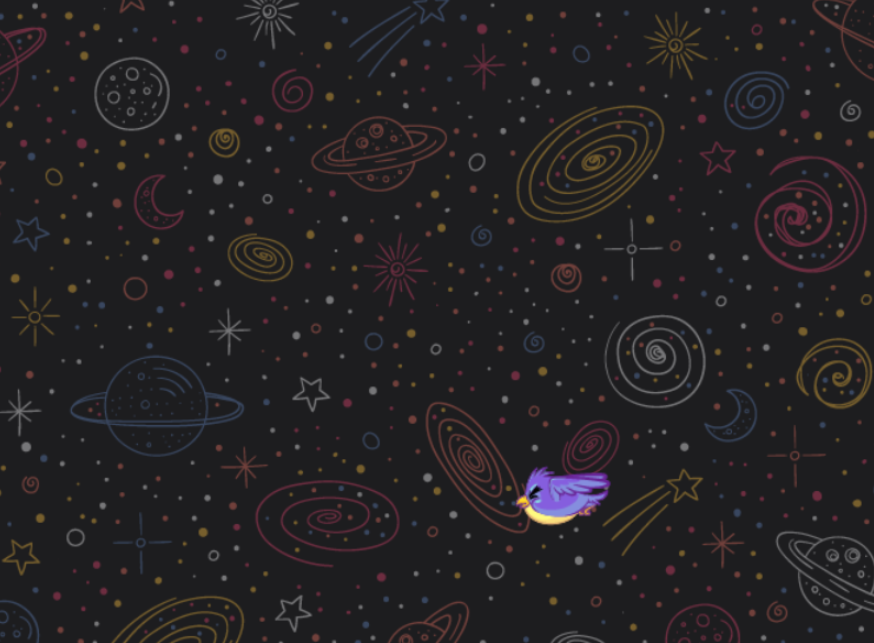

# Phaser Bird Game

Este projeto é um jogo interativo desenvolvido com a framework **Phaser.js**, com o objetivo de treinar minhas habilidades em JavaScript. O jogo apresenta um passarinho que se move horizontalmente e verticalmente dentro da tela, proporcionando uma experiência divertida e dinâmica.

## 🛠️ Tecnologias Utilizadas

- **JavaScript**: Linguagem de programação principal utilizada no desenvolvimento do jogo.
- **Phaser.js**: Framework para desenvolvimento de jogos em 2D, que facilita a criação de animações e interações.

## 📸 Screenshots

  

## 🚀 Funcionalidades

- **Movimento Horizontal e Vertical do Passarinho**: O passarinho se move de forma contínua, alternando sua direção quando atinge os limites da tela.
- **Animação da Sprite**: O passarinho possui uma animação fluida, que simula seu voo.
- **Fundo Espacial**: Um fundo visual representa o ambiente do jogo, enriquecendo a experiência do usuário.

## 📝 Aprendizados

- **Fundamentos do Phaser.js**: Aprendi a configurar um projeto básico de jogo com Phaser, incluindo pré-carregamento de imagens e gerenciamento de animações.
- **Movimentação e Interatividade**: Melhorei minhas habilidades em manipulação de objetos e controle de animações, além de implementar lógica para o movimento bidimensional.
- **Estruturação de Jogos**: Entendi melhor como estruturar jogos em 2D utilizando cenas, sprites e atualizações em tempo real.
